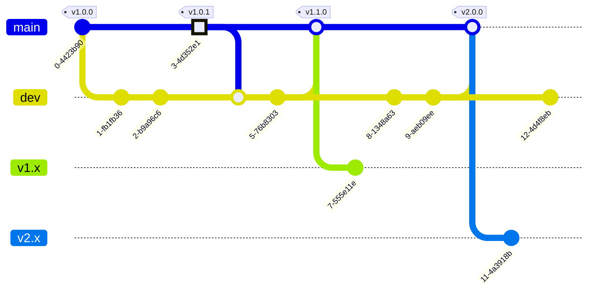

# wisteriaMC

<p align="left">
  
  
  
  
</p>

Движок и веб-платформа, разработанные специально для проекта **WisteriaMC**.

> [!WARNING]
> Руководство не полное и требует обновления, однако запустить приложение все еще можно.

> [!IMPORTANT]
> Данный движок написан исключительно под внутренние задачи **Wisteria**. Любое стороннее использование осуществляется на ваш собственный страх и риск. На текущем этапе системы жестко заточены под конкретную архитектуру, поэтому масштабирование или перенос на другие проекты могут быть затруднены.

---

## О проекте

На данном этапе движок находится в статусе активной разработки (черновой вариант). В будущем он планируется как стабильное, высокопроизводительное решение для Minecraft-проектов с быстрым откликом, построенное на связке PHP и современного JavaScript.

Продукт является некоммерческим. Основная цель - раскрытие потенциала используемых сред разработки с последующей демонстрацией архитектуры на боевом проекте.

### Особенности:
* **Backend:** Классический PHP в качестве серверной части веб-платформы - это обеспечивает низкий порог входа для разработчиков, желающих запустить или поддержать проект.
* **Frontend:** Современный, технологичный интерфейс на базе **Tailwind CSS** и компонентов **Flowbite**.
* **Архитектура:** Удобная, модульная и независимая база проекта, в которой легко разобраться.

---

## Быстрый старт

Данное руководство предназначено для экспресс-установки и запуска локального окружения. Для глубокого погружения изучите раздел Wiki.

### Установка

Установочный скрипт автоматически проверяет наличие необходимых утилит в системе и, при необходимости, пытается развернуть их самостоятельно (Node.js, Composer, pnpm), после чего запускает установку зависимостей:
`pnpm install && composer install`

> [!TIP]
> Для обеспечения максимальной стабильности мы **рекомендуем установить ключевые инструменты вручную**.
> Отличным выбором для Windows-разработчиков станет **[OSPanel](https://ospanel.io/)** - он уже содержит из коробки PHP, MySQL, Composer и подготовленное окружение.

#### Шаг 1: Запуск установочного скрипта

Выполните команду в терминале для загрузки и запуска установщика.

```bash
curl -fsSL https://raw.githubusercontent.com/NiRBES02/wisteriamc/main/install.sh | bash

```

Если вы используете Git Bash / WSL:

```bash
curl -fsSL https://raw.githubusercontent.com/NiRBES02/wisteriamc/main/install.sh | bash

```

Если вы используете PowerShell:

```powershell
Invoke-RestMethod https://raw.githubusercontent.com/NiRBES02/wisteriamc/main/install.sh | bash

```

#### Шаг 2: Настройка конфигурации

1. Переименуйте файл `.env.example` в корневом каталоге в `.env`.
2. Откройте его и укажите необходимые доступы и параметры.

Текущая сборка содержит Discord-бота со встроенной системой модерации на базе локальной ИИ-модели **Ollama** (`gemma2:2b`). Вы можете установить любую другую модель, выполнив команду `ollama run <model_name>` (список доступных моделей можно найти на [официальном сайте Ollama](https://ollama.com/search)).

> [!WARNING]
> Тщательно выбирайте ИИ-модели, так как они требовательны к объёму оперативной памяти (RAM).

> [!NOTE]
> ***NiRBES:*** Я остановился на `gemma2:2b`, так как она максимально легковесная, не нагружает хост и при этом неплохо справляется с контекстом модератора. Мне удалось без проблем запустить её даже на телефоне внутри Termux.

```env
# Ollama settings
OLLAMA_MODEL='gemma2:2b'

# Discord settings
DISCORD_TOKEN='YOUR_DISCORD_TOKEN'

```

#### Отключение/включение модулей Discord-бота

В текущей версии система ИИ-модерации выключена по умолчанию и не вынесена в `.env` или конфигурацию. Если вам необходимо включить её, просто разкомментируйте строку вызова функции внутри события `messageCreate`:

`src-server/plugins/discord/events/messageCreate.js`

```javascript
import { Events } from 'discord.js';

// NiRBES: Что бы не захламлять основной файл события, выносим всю логику взаимодействий с сообщениями в отдельное место.
// import moderate from './messageCreate/moderate.js';
import news from './messageCreate/news.js';

export default {
    name: Events.MessageCreate,
    async execute(context, message) {
        if (message.author.bot) return;

        // NiRBES: Так как сейчас нет возможности отключить или включить подмодули плагинов, то приходится пользоваться такими примитивными способами, хочешь включить модерацию сообщений в дискорде, просто раскомментируй строчку снизу
        // await moderate(context, message);

        await news(context, message);
    }
};

```

# Схема Git flow

Для управления процессом разработки наша команда использует адаптированную модель Git Flow, ориентированную на выпуск LTS релизов. Ниже описаны ключевые принципы, по которым мы работаем с кодом.

### Политика поддержки и версионирования

Мы поддерживаем и развиваем **только последнюю актуальную LTS версию** продукта. Все наши силы направлены на стабилизацию ветки `dev` и её последующий выпуск в `main`. При переходе на новую мажорную линейку, предыдущая ветка навсегда получает статус **EOL**. Мы **не поддерживаем** архивные ветки: для них больше не выпускаются хотфиксы, патчи безопасности и обновления На момент финального пуша в архивную ветку, в ней фиксируется самое последнее и актуальное состояние этой версии, после чего разработка в ней полностью прекращается. Мы сохраняем эти ветки в репозитории **исключительно для ознакомления** и исторической справки.


### Ветки

* **`main`** - стабильный движок проекта. Сюда мы выпускаем только актуальные версии и критические хотфиксы. Каждый коммит в этой ветке обязательно сопровождается тегом.
* **`dev`** - основная рабочая среда, где мы ведём разработку и готовим функционал для следующего крупного LTS релиза.
* Остальные ветки являются архивными и устаревшими.


---

## Разработка и контрибьютинг

Если у вас есть идеи по оптимизации, рефакторингу архитектуры, улучшению фронтенда или документации - Pull Requests всегда открыты.

### Контакты:

* **Discord сервер:** [Wisteriamc Community](https://discord.gg/wisteriamc)
* **Discord автора:** dev_nirbes
* **Взаимодействие:** Создавайте форк репозитория, вносите изменения в отдельную ветку и отправляйте Pull Request.

### Рекомендуемые расширения VS Code (Опционально)

Для комфортной работы с кодовой базой проекта рекомендуется установить дополнения, настроенные в рабочей области которые указаны в `.vscode`:

* **Tailwind CSS IntelliSense** - для удобной работы с классами утилит v4.
* **Todo Tree** - в проекте используются кастомные теги и подсветка комментариев автора (`// NiRBES:`), что позволяет мгновенно ориентироваться в архитектурных решениях, находить важные участки кода и оставленные задачи.

---

<br>
<p align="center">💜 Developed by <b>NiRBES</b></p>